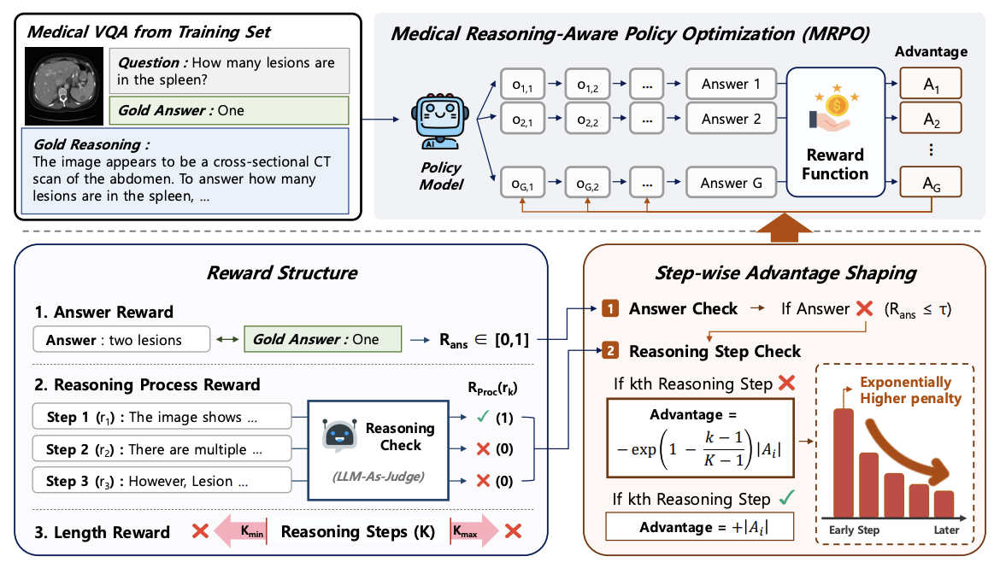
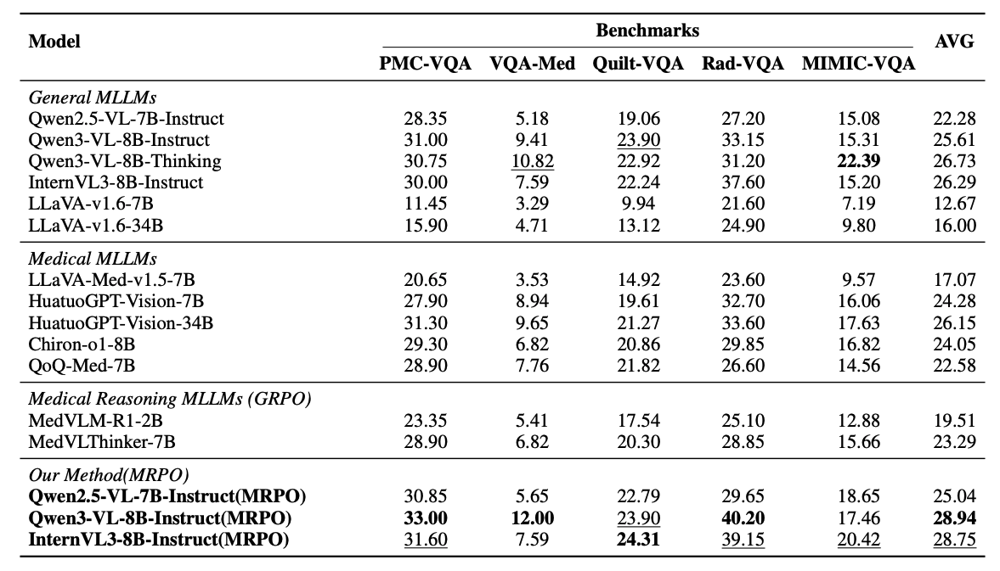
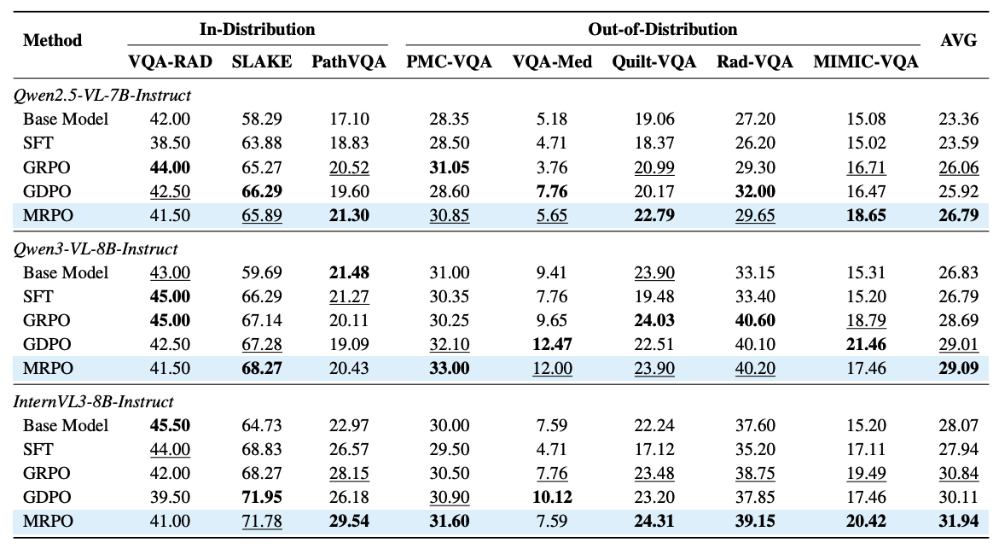
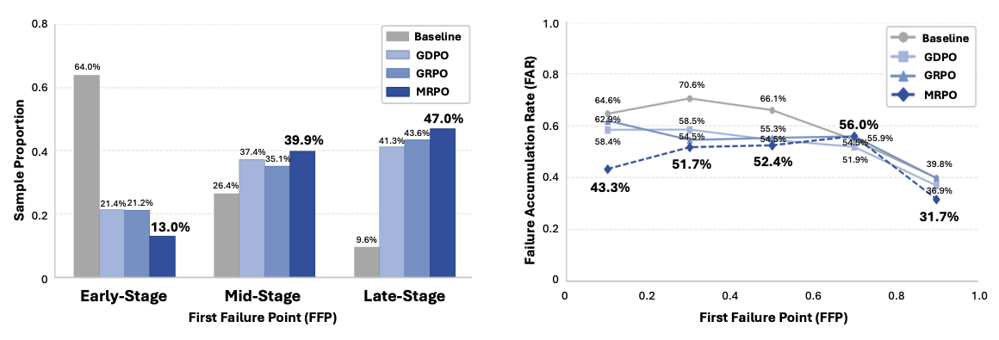

# Breaking Failure Cascades: Step-Aware Reinforcement Learning for Medical Multimodal Reasoning

<p align="left">
  <a href="https://arxiv.org/abs/2606.31825" target="_blank"></a>
  <a href="https://jungjunha.github.io/MRPO-page/" target="_blank"></a>
  <a href="https://huggingface.co/collections/dmis-lab/mrpo" target="_blank"></a>
</p>


### News
* [June/30/2026] 🎉 We release our paper "Breaking Failure Cascades: Step-Aware Reinforcement Learning for Medical Multimodal Reasoning" on arXiv.


## 📖 Overview
- MRPO is a novel reinforcement learning framework that improves medical multimodal reasoning by directly addressing failures in the reasoning process. It reshapes GRPO-style advantages using both answer-level and step-wise process rewards, assigning exponentially larger penalties to earlier invalid steps when the final answer is incorrect, thereby correcting early-stage failures before they cascade while preserving successful trajectories. By redistributing the learning signal according to where reasoning first fails, MRPO induces transferable reasoning that improves both reasoning quality and final answer accuracy across diverse medical VQA benchmarks.



## Key Results
- On out-of-distribution medical VQA benchmarks, MRPO consistently outperforms standard GRPO and a recent RL baseline across all three backbones, and on Qwen3-VL-8B-Instruct even surpasses substantially larger medical MLLMs like HuatuoGPT-Vision-34B by 2.79 points using only 13K training samples. On step-wise reasoning analysis, MRPO breaks failure cascades by reducing early-stage reasoning failures from 64.0% to 13.0%, showing that targeted mitigation of early failures improves both reasoning quality and final answer accuracy.


### Answer Accuracy Comparison

**Performance comparison of MRPO against existing MLLMs**



**Cross-backbone ablation of training methods**




### Reasoning Quality Comparison




## 🚀 Reproducibility
To enable reproduction under the same settings as our experiments, we release our full reinforcement learning recipe, including the complete code, datasets, and infrastructure.


### Environment Setup
We recommend using conda to set up the environment:

```bash
bash install_env.sh
conda activate mrpo
```

---

### Datasets
To download and preprocess all datasets used in our experiments, run:

```bash
python Download_dataset.py \
  --data-dir <directory-to-download-data>
```

Each training instance follows the format below, with `image`, `problem`, and `solution` keys:

```json
{
  "image": "/Data_RAW/vqa-rad/images/synpic54610.jpg",
  "problem": "Where is the pathology in this image?",
  "solution": "vasculature"
}
```

If you want to download the datasets individually, the three medical VQA benchmarks can be obtained from their original sources: VQA-RAD from [flaviagiammarino/vqa-rad](https://huggingface.co/datasets/flaviagiammarino/vqa-rad), SLAKE from [BoKelvin/SLAKE](https://huggingface.co/datasets/BoKelvin/SLAKE), and PathVQA from [flaviagiammarino/path-vqa](https://huggingface.co/datasets/flaviagiammarino/path-vqa). The gold reasoning annotations are provided by MedThink, which can be downloaded from [Tang-xiaoxiao/Medthink](https://github.com/Tang-xiaoxiao/Medthink). After downloading, align each MedThink rationale to its corresponding VQA instance to reproduce our training set.

---

### Training
Run the training script:

```bash
bash Train_MRPO.sh
```

**Note**: Please update the following environment variables in the script:
- `<DATA_DIR>`: Dataset root path (use the same directory specified in `--data-dir` during dataset download)
- `<MODEL_DIR>`: Backbone model path
- `<BIOMEDBERT_PATH>`: BiomedBERT path for BERTScore in the answer reward
- `<OUTPUT_DIR>`: Output directory path
- `<WANDB_API_KEY>`: Weights & Biases API key
- `<WANDB_PROJECT>`: Weights & Biases project name

We currently support training on Qwen2.5-VL, Qwen3-VL, and InternVL3. The `<MODEL_DIR>` path must contain the corresponding model name (i.e., `qwen2.5-vl`, `qwen3-vl`, or `internvl3`).

---

### Inference
Run the inference script:

```bash
python inference.py \
  --model_path <path-to-trained-model> \
  --test_json <path-to-test-json> \
  --output_dir <path-to-output-dir> \
  --cuda_visible_devices <gpu-ids>
```
After running `Download_dataset.py`, the test set is available at `<DATA_DIR>/Data_Preprocessed/test_open_ended.json`, which can be passed directly to `--test_json`. The test data must follow the same format as the training data, with each instance containing the `image`, `problem`, and `solution` keys.

---

### Evaluation
We provide two evaluation protocols, both using GPT-5-mini as an LLM judge. **Answer correctness** assesses whether the generated answer matches the ground-truth answer, reported as the proportion of examples judged correct. **Reasoning evaluation** assesses step-wise reasoning quality by scoring each reasoning step as valid or invalid against the gold reasoning trajectory.

**Answer correctness:**

```bash
python Eval_code/Answer_Evaluation.py \
  --input_json <path-to-inference-output-json> \
  --output_json <path-to-answer-eval-output-json>
```

**Reasoning evaluation:**

```bash
python Eval_code/Reasoning_Evaluation.py \
  --input_json <path-to-inference-output-json> \
  --output_json <path-to-reasoning-eval-output-json> \
  --gold_reasoning_file <path-to-gold-reasoning-json>
```


## Contact
Feel free to reach out to goodjungjun@korea.ac.kr or wjdalsquf@gmail.com

BibTeX Citation: If you use MRPO in your research, please cite it using the following BibTeX entry:

   ```bibtex
        @misc{jung2026breakingfailurecascadesstepaware,
        title={Breaking Failure Cascades: Step-Aware Reinforcement Learning for Medical Multimodal Reasoning}, 
        author={Junha Jung and Minbyul Jeong and Suhyeon Lim and Sungwook Jung and Jaehoon Yun and Taeyun Roh and Mujeen Sung and Jaewoo Kang},
        year={2026},
        eprint={2606.31825},
        archivePrefix={arXiv},
        primaryClass={cs.CV},
        url={https://arxiv.org/abs/2606.31825}, 
        }
   ```